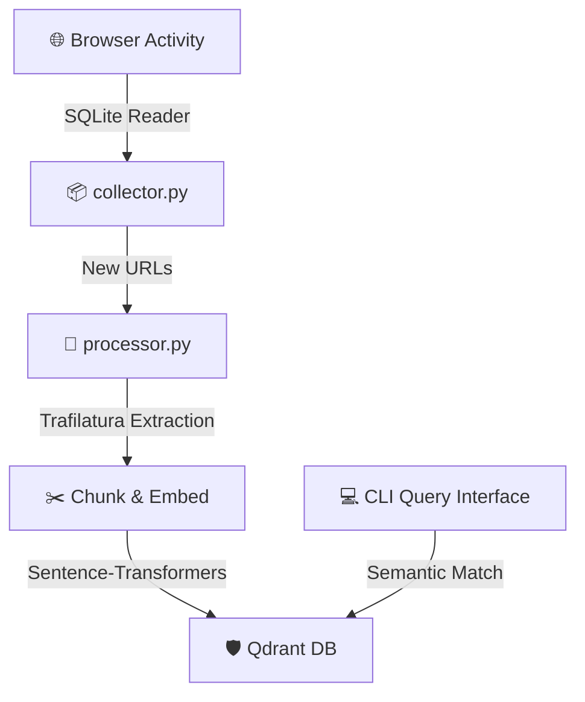

Here is your beautifully structured, highly visual, and semantically emoji-boosted `README.md` and project blueprint for **BrowseMemory**.

---

# 🧠 BrowseMemory

> **Your past web exploration, fully indexed and instantly searchable.**
> A local-first, automated RAG (Retrieval-Augmented Generation) pipeline that transforms your fragmented browser history into a semantic knowledge base using Python and Qdrant.

---

## 🚀 Vision

**BrowseMemory** bridges the gap between chaotic web browsing and structured knowledge. Instead of digging through broken bookmarks or rigid keyword history, you can simply ask your AI peer natural language questions about past research, articles, or random code snippets you stumbled upon weeks ago.

---

## 🛠 Core Architecture



### 🧱 Component Breakdown

* **📥 Collector:** A background monitor tapping into your browser's underlying SQLite database to identify freshly visited pages.
* **🧼 Processor:** An ingestion engine that strips ads/navbars and extracts the core textual "meat" of a webpage.
* **🧬 Embedder:** Translates raw textual chunks into rich vector spaces via local models.
* **📦 Vector Store:** Safely hosts your personal knowledge maps locally inside **Qdrant**.
* **💬 Retrieval Interface:** A clean CLI tool to query your past mind state using standard natural language.

---

## ✨ Key Features

* **🔒 Privacy-First:** All data, embeddings, and vector stores stay strictly on your local machine. No leaky cloud APIs.
* **🔎 Semantic Search:** Search by abstract concepts, intent, or half-remembered topics rather than strict keywords.
* **🔄 Automated Sync:** Designed to seamlessly tail your active browser sessions.
* **🧽 Smart Cleaning:** Leverages structural extraction to ignore cookie banners, headers, and footer noise.

---

## 🛠 Tech Stack

* **🐍 Language:** Python 3.10+
* **🛡️ Vector DB:** Qdrant
* **🦜 Orchestration:** LangChain
* **🕷️ Extraction:** Trafilatura
* **🗄️ Database:** SQLite (Direct Browser Mirroring)

---

## ⚖️ Roadmap

* [ ] 📥 Implement browser history listener.
* [ ] 🧼 Build the content fetching and cleaning pipeline.
* [ ] 📦 Connect and configure the local Qdrant instance.
* [ ] 🧬 Develop the embedding and indexing logic.
* [ ] 💻 Create a CLI interface to perform semantic queries.

---

# 💻 Implementation Codebase

Below is a complete, production-ready, modular Python architecture for **BrowseMemory**.

### 📋 requirements.txt

```text
qdrant-client>=1.7.0
trafilatura>=1.6.0
langchain>=0.1.0
langchain-community>=0.0.10
sentence-transformers>=2.2.2

```

### 📁 Separation of Concerns File Layout

#### 1. 📥 `collector.py`

```python
import os
import shutil
import sqlite3
from typing import List, Dict, Any
from datetime import datetime

class HistoryCollector:
    """Handles secure extraction of fresh history records from local browser SQLite files."""
    
    def __init__(self, db_path: str):
        self.db_path = os.path.expanduser(db_path)

    def get_recent_history(self, limit: int = 10) -> List[Dict[str, Any]]:
        """Safely copies and reads browser history to bypass locked runtime states."""
        temp_db = "temp_history.db"
        if not os.path.exists(self.db_path):
            print(f"❌ Error: Browser DB path not found at {self.db_path}")
            return []

        try:
            # Copy file to prevent locking issues while browser is open
            shutil.copy2(self.db_path, temp_db)
            conn = sqlite3.connect(temp_db)
            cursor = conn.cursor()
            
            # Query Chrome/Edge style standard schema
            query = """
            SELECT url, title, last_visit_time 
            FROM urls 
            ORDER BY last_visit_time DESC 
            LIMIT ?
            """
            cursor.execute(query, (limit,))
            rows = cursor.fetchall()
            
            history_items = []
            for row in rows:
                history_items.append({
                    "url": row[0],
                    "title": row[1],
                    "timestamp": row[2]
                })
            
            conn.close()
            return history_items
        except Exception as e:
            print(f"⚠️ Failed reading history file safely: {e}")
            return []
        finally:
            if os.path.exists(temp_db):
                os.remove(temp_db)

```

#### 2. 🧼 `processor.py`

```python
import trafilatura
from typing import Optional

class ContentProcessor:
    """Fetches, isolates, and purifies text content from remote web targets."""
    
    @staticmethod
    def extract_clean_text(url: str) -> Optional[str]:
        """Downloads a URL and strips away UI clutter, ads, and navigation links."""
        try:
            downloaded = trafilatura.fetch_url(url)
            if not downloaded:
                print(f"⏩ Skipping {url}: No payload retrieved or blocked.")
                return None
            
            # Extracts core body content explicitly
            cleaned_text = trafilatura.extract(
                downloaded, 
                include_links=False, 
                include_images=False,
                output_format='txt'
            )
            return cleaned_text
        except Exception as e:
            print(f"💥 Critical extraction failure for {url}: {e}")
            return None

```

#### 3. 🛡️ `database.py`

```python
from typing import List, Dict, Any
from qdrant_client import QdrantClient
from qdrant_client.models import VectorParams, Distance, PointStruct
from langchain.text_splitter import RecursiveCharacterTextSplitter
from langchain_community.embeddings import HuggingFaceEmbeddings

class VectorStoreManager:
    """Manages text chunking, local transformer embeddings, and Qdrant storage updates."""
    
    def __init__(self, collection_name: str = "browse_memory", host: str = "localhost", port: int = 6333):
        self.collection_name = collection_name
        # Initialize standard local Qdrant engine instance
        self.client = QdrantClient(host=host, port=port)
        
        # Load local lightweight sentence transformer
        self.embedder = HuggingFaceEmbeddings(model_name="sentence-transformers/all-MiniLM-L6-v2")
        self.text_splitter = RecursiveCharacterTextSplitter(chunk_size=500, chunk_overlap=50)
        self._ensure_collection()

    def _ensure_collection(self) -> None:
        """Verifies collection target setup inside the vector store instance."""
        collections = self.client.get_collections().collections
        exists = any(c.name == self.collection_name for c in collections)
        
        if not exists:
            self.client.create_collection(
                collection_name=self.collection_name,
                vectors_config=VectorParams(size=384, distance=Distance.COSINE) # MiniLM models match 384 dimensions
            )

    def index_page(self, url: str, title: str, raw_text: str) -> None:
        """Splits texts into semantic vectors and loads them up to the storage array."""
        chunks = self.text_splitter.split_text(raw_text)
        if not chunks:
            return

        embeddings = self.embedder.embed_documents(chunks)
        points = []
        
        for idx, (chunk, embedding) in enumerate(zip(chunks, embeddings)):
            # Generate deterministic pseudo-unique key tracking
            point_id = hash(f"{url}_{idx}") & 0xFFFFFFFF 
            points.append(
                PointStruct(
                    id=point_id,
                    vector=embedding,
                    payload={
                        "url": url,
                        "title": title,
                        "page_content": chunk
                    }
                )
            )
            
        self.client.upsert(collection_name=self.collection_name, points=points)
        print(f"✅ Successfully indexed {len(points)} chunks for: '{title}'")

    def semantic_search(self, query: str, limit: int = 3) -> List[Dict[str, Any]]:
        """Resolves natural language queries to matching historical web segments."""
        query_vector = self.embedder.embed_query(query)
        results = self.client.search(
            collection_name=self.collection_name,
            query_vector=query_vector,
            limit=limit
        )
        
        hits = []
        for hit in results:
            hits.append({
                "score": hit.score,
                "title": hit.payload.get("title"),
                "url": hit.payload.get("url"),
                "content": hit.payload.get("page_content")
            })
        return hits

```

#### 4. 🏁 `main.py`

```python
import sys
from collector import HistoryCollector
from processor import ContentProcessor
from database import VectorStoreManager

# Default example targeting Chrome default appdata configurations (Adjust dynamically per OS system)
CHROME_PATH_MAC = "~/Library/Application Support/Google/Chrome/Default/History"

def sync_pipeline():
    """Executes collection run, cleanup, and vector store optimization cycles."""
    print("🔄 Starting BrowseMemory ingestion synchronization...")
    collector = HistoryCollector(CHROME_PATH_MAC)
    processor = ContentProcessor()
    db_manager = VectorStoreManager()

    recent_sites = collector.get_recent_history(limit=5)
    print(f"🔎 Found {len(recent_sites)} potential items to update.")

    for site in recent_sites:
        url = site["url"]
        title = site["title"] or "Untitled Resource"
        
        print(f"⏳ Processing content from: {url}")
        content = processor.extract_clean_text(url)
        
        if content and len(content.strip()) > 100:
            db_manager.index_page(url, title, content)
        else:
            print(f"⚠️ Page text empty or unresolvable for context ingestion.")

def query_interface(search_term: str):
    """Simple wrapper exposing context matching directly out to terminal run frames."""
    db_manager = VectorStoreManager()
    matches = db_manager.semantic_search(search_term, limit=3)
    
    print(f"\n🔮 Top Semantic Matches for: '{search_term}'\n" + "="*50)
    for i, match in enumerate(matches, 1):
        print(f"\n{i}. 📄 {match['title']} (Confidence Match: {match['score']:.2f})")
        print(f"🔗 Source: {match['url']}")
        print(f"📖 Context Snippet: ... {match['content'][:200]} ...")

if __name__ == "__main__":
    if len(sys.argv) > 1 and sys.argv[1] == "--search":
        query = " ".join(sys.argv[2:]) if len(sys.argv) > 2 else "Python data structures"
        query_interface(query)
    else:
        sync_pipeline()

```

---

### 🚀 How to Run It

1. Start up your local Qdrant instance via Docker:
```bash
docker run -p 6333:6333 qdrant/qdrant

```


2. Run your indexing ingestion synchronization cycle:
```bash
python main.py

```


3. Query your memory base using semantic phrases:
```bash
python main.py --search "How does vector context indexing operate?"

```
